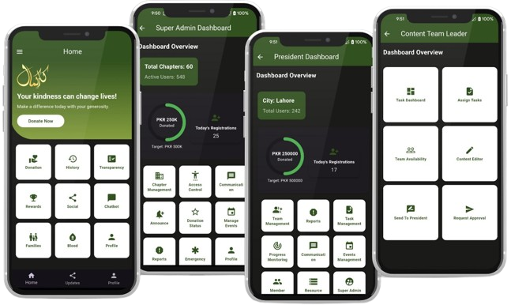

# Muhammad Saqib

## 👨‍💻 Bio
Hi, I'm Muhammad Saqib — a Computer Science student at UET Lahore, Flutter developer, and Generative AI enthusiast. With experience across mobile app development, AI-integrated systems, and leadership roles, I thrive at the intersection of technology and impact. I'm passionate about building scalable applications and mentoring future tech leaders.

## 🛠 Tech Stack
- **Languages**: Dart, Python, C++, Java
- **Mobile Development**: Flutter (Cross-platform)
- **AI Skills**: Generative AI, Model Building, Agentic AI
- **Web**: WordPress, HTML, CSS, Bootstrap
- **Databases**: SQL, Firebase
- **Tools**: VS Code, Android Studio, Visual Studio
- **Version Control**: Git, GitHub

## 🚀 Favorite Projects
- 📱 **Kaar-e-Kamal App**  
A cross-platform app for a welfare organization operating in 60+ cities. Includes donation prediction, Firebase backend, REST APIs, and agentic AI for personalized messages and target adjustment.  
_[View App/Repo](https://github.com/Muhammadsaqibsharif/kaar_e_kamal.git)_

    

- 🧠 **AI-Powered-Anti-Short-Video-Addiction-Assistant**  
An AI-driven assistant designed to detect and reduce short-video overconsumption.
It uses machine learning and agentic intelligence to deliver real-time, personalized interventions..  
_[View App/Repo](https://github.com/Muhammadsaqibsharif/AI-Powered-Anti-Short-Video-Addiction-Assistant.git)_
 

- 🌐 **WordPress Sites (Freelance)**  
  Created responsive, SEO-optimized eCommerce websites with WooCommerce integration for Fiverr clients.  
  _[See Fiverr Profile](https://www.fiverr.com/msaqib10)_

## 🎯 Fun Fact or Quote
> “Code is like humor. When you have to explain it, it’s bad.” 
– Cory House

## 🔗 GitHub Profile
[https://github.com/Muhammadsaqibsharif](https://github.com/Muhammadsaqibsharif)

## 🌐 Linktree
[All my links in one place](https://linktr.ee/msaqibsharif)
---

🌟 _Also connect with me on [LinkedIn](https://www.linkedin.com/in/msaqibsharif) or check out my [Portfolio Website](https://muhammadsaqibsharif.github.io/)_
